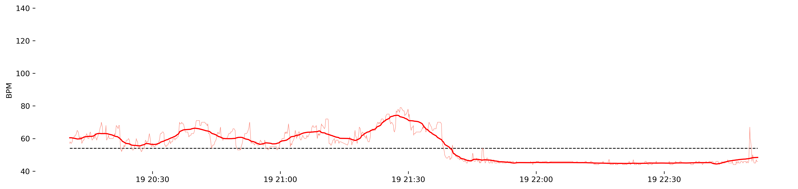
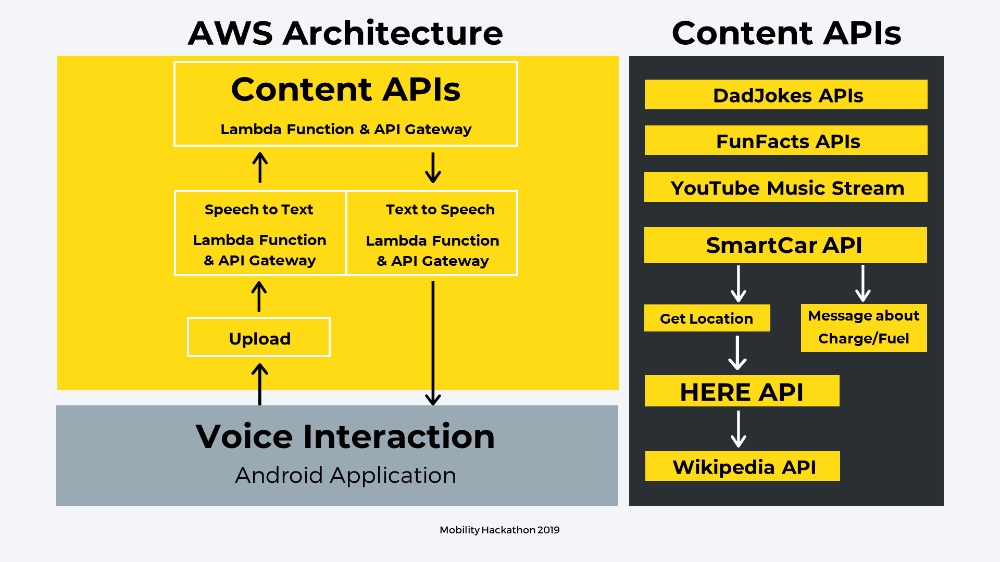

# RoadBuddy

## Hackmobility 2019, where it all began ...

`Authors: Oskar Radermecker, Victor Debray, Meryll Dindin`

## A problem we have personally experienced ...

Accidents due to drowsy drivers continue to increase yearly. Those are accounted for 72,000 in 2013, and 91,000 in 2017. It is more than **800 fatalities** each year! - NHTSA

**We know it is dangerous - but we still do it anyways.** Approximately 50% of US drivers admit to driving while being drowsy. 20% admitted to falling asleep behind the wheel at some point in the past year. Drowsy driving affects everyone, but particularly those driving alone between midnight and 6 a.m., or in the late afternoon.

## To tackle this issue, we have come up with ...

`OUR PROPOSED SOLUTION: A buddy for everyone that will keep you alert during your trip without them nagging you about how bad of a driver you are!`

We all know that **prevention** is more efficient than **cure**, we aimed to develop a pattern of active prevention. Our idea is to do timely check-ins to make sure you are all-right, and suggestions to take a break from driving. This happens every hour of driving, and can easily be modified through the user personal settings.

Aside from active prevention, we also looked into a way to **monitor the driver** directly. The idea of drowsiness detection through facial recognition is pretty widespread technically speaking, but very unlikely to be accepted by a community caring about their privacy. We thus oriented our approach to the previous work of one of our team-member: Using the heart rate variability signal to monitor the driver's condition. The information about BPM (R-R peaks distances) is enough to determine a drowsy state, as we all tend to physiologically having a steadily decreasing rate when fatigue catches up. For your own interest, here is a list of papers supporting this idea:

* [Drowsiness detection using heart rate variability.](https://www.ncbi.nlm.nih.gov/pubmed/26780463)
* [Non-Contact Driver Drowsiness Detection System](https://pdfs.semanticscholar.org/708f/3030623085fe29ad5d8246a8079e2cf99aee.pdf)
* [Heart Beat Based Drowsiness Detection System for Driver](https://www.researchgate.net/publication/329318557_Heart_Beat_Based_Drowsiness_Detection_System_for_Driver)
* [Detecting Drowsy Driver Using Pulse Sensor](https://www.researchgate.net/publication/275222360_Detecting_Drowsy_Driver_Using_Pulse_Sensor)
* [Heart Rate Change While Drowsy Driving](https://www.ncbi.nlm.nih.gov/pmc/articles/PMC6393761/)

On our end, we chose to implement this approach through our connected watches (FitBit in this case), but that would also be feasible with an Apple Watch or any similar smart watch.

PLAY A GAME OR ASK FOR JOKES AND RIDDLES: Keep yourself busy by playing games like 'Name That Tune', or joke away with RoadBuddy.

LEARN SOMETHING NEW: Hearing fun facts, or something interesting about the area you are driving in will surely keep you intriqued and alert.

CALL A FRIEND (OR FAMILY): RoadBuddy can intelligently suggest someone you could call, and propose interesting discussion topics.

## Here is a glimpse of what our architecture looks like ...

